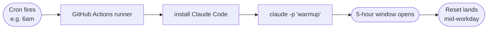

<div align="center">


# claude-warmup

**An alarm clock for a lazy Claude.** ☀️

A tiny scheduled GitHub Action that starts your Claude Code 5-hour usage window *before* you sit down to work — so the reset lands mid-workday instead of mid-evening.

[](https://github.com/LeandHadergjonaj/claude-warmup/actions/workflows/warmup.yml)
[](LICENSE)
[](.github/workflows/warmup.yml)
[](#)

</div>

---

## Why

Claude Code's usage runs on a **rolling 5-hour window that starts on your first message** and resets on its own 5 hours later. If you don't start the clock until you sit down, your reset lands late in the day — right when you're still working.

`claude-warmup` fires one tiny throwaway prompt on a schedule (say, early morning), so the window opens early and the reset rolls around mid-workday, when you'll actually use it.

> [!IMPORTANT]
> This is a **timing tool, not a cheat.** It does *not* give you more usage — the per-window allowance is fixed and resets automatically. It also does nothing for the separate weekly cap. All it changes is *when* your window starts.

## How it works



Your machine doesn't need to be on — GitHub's servers run the schedule for you.

## Quick start

1. **Add the workflow** at `.github/workflows/warmup.yml` (already here if you cloned this).
2. **Mint a token.** On a machine with Claude Code installed and logged in:
```bash
   claude setup-token
```
   Copy the `sk-ant-oat01-…` value.
3. **Add it as a repo secret:** *Settings → Secrets and variables → Actions → New repository secret*
   - Name: `CLAUDE_CODE_OAUTH_TOKEN`
   - Value: the token
4. **Pick your time.** Edit the `cron:` line (it's UTC — convert at [crontab.guru](https://crontab.guru)).
5. **Test it.** *Actions → warmup → Run workflow.* A green check means you're set. ✅

## Configuration

Edit the schedule in [`.github/workflows/warmup.yml`](.github/workflows/warmup.yml). All times are **UTC**.

| Your day | Suggested cron |
|---|---|
| 9–5, want the reset late morning | `0 6 * * 1-5` |
| Long days / full coverage | `0 6,11,16 * * 1-5` |
| Every ~5h around the clock (overkill) | `0 0,5,10,15,20 * * *` |

You can also trigger it manually from the Actions tab and pass a custom prompt.

## FAQ

**Does this get me more usage?** No. The window's allowance is fixed; this only moves *when* it starts.

**Is it allowed?** It uses documented, intended behavior — you're just choosing when your window opens. Keep it to your working hours and don't loop real prompts; the weekly cap is there to catch 24/7 background usage.

**Warmups stopped after a while?** Two usual causes: GitHub disables scheduled workflows after **60 days with no commits** (push anything to re-enable), or your token expired — rerun `claude setup-token` and update the secret.

**Do I need a paid plan?** Yes — the 5-hour window only exists on Claude Pro/Max. There's nothing to warm on free or API pay-as-you-go.

## License

[MIT](LICENSE) — do whatever you like.
